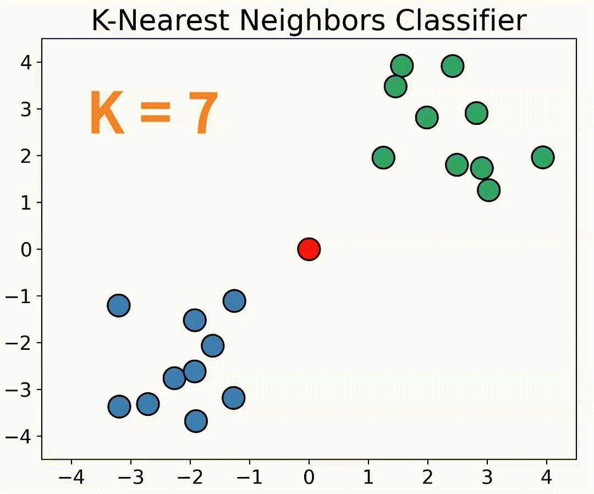

# K-Nearest Neighbors Classifier Repository

Welcome to the KNN Algorithm repository, an integral part of my exploration into machine learning algorithms, as documented on my blog [Data Science For Lifelong Learning](https://datasciencelifelonglearn.blogspot.com). This space is meticulously curated to offer both novices and experts a deep understanding of the KNN classifier algorithm, its applications, and its significance in the realm of supervised learning.

   <!-- You can adjust the width value as needed -->

## Table of Contents
